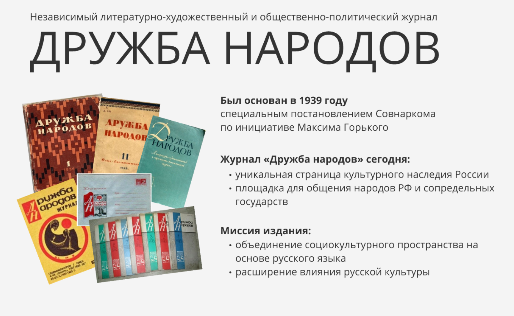
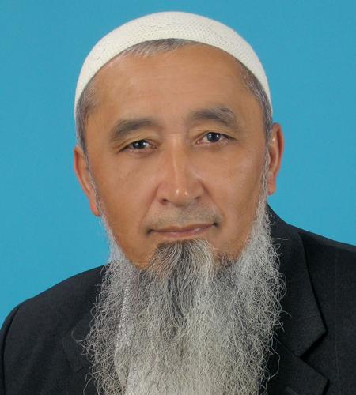
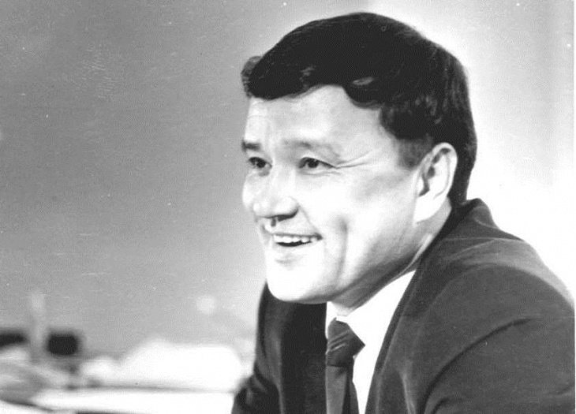
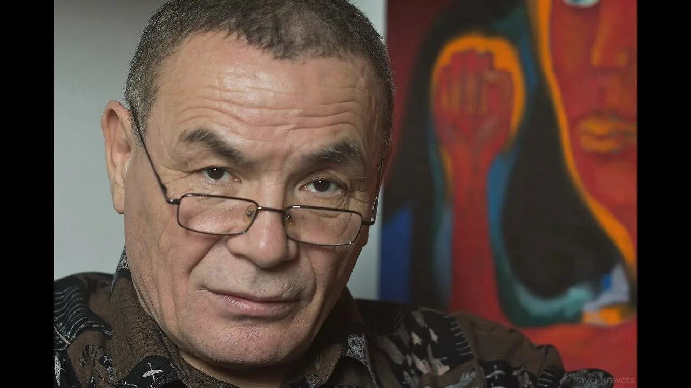

# ДРУЖБА НАРОДОВ

Независимый литературно-художественный и общественно-политический журнал. Выходит с 1939 года.

Независимый литературно-художественный и общественно-политический журнал.

**Был основан в 1939 году** специальным постановлением Совнаркома по инициативе Максима Горького.

**Журнал «Дружба народов» сегодня:**
- уникальная страница культурного наследия России
- площадка для общения народов РФ и сопредельных государств

**Миссия издания:**
- объединение социокультурного пространства на основе русского языка
- расширение влияния русской культуры

## На страницах журнала в XX веке

**Абдулла Каххар**

**Гафур Гулям**

**Айбек**

**Уйгун**

**Зульфия**

**Мирмухсин**

## Узбекский номер 2026

- юбилейный выпуск к 585-летию со дня рождения Алишера Навои, включающий оригинальное жизнеописание поэта и мыслителя
- обзор современной узбекской прозы и поэзии
- презентация узбекской литературной периодики
- уникальная подборка текстов лучших современных узбекских авторов. Среди них: Евгений Абдуллаев, Тагай Мурад, Вадим Муратханов, Рифат Гумеров и др.

Сабит Мадалиев – поэт, прозаик, философ, публицист, автор суфийской поэзии и притч. «Была сокрыта скорбь моя» — уникальный труд про жизнь Навои с точки зрения духовного пути и практики суфизма.

**Евгений Абдуллаев**

**Вадим Муратханов** — лауреат премии журнала «Дружба народов»

